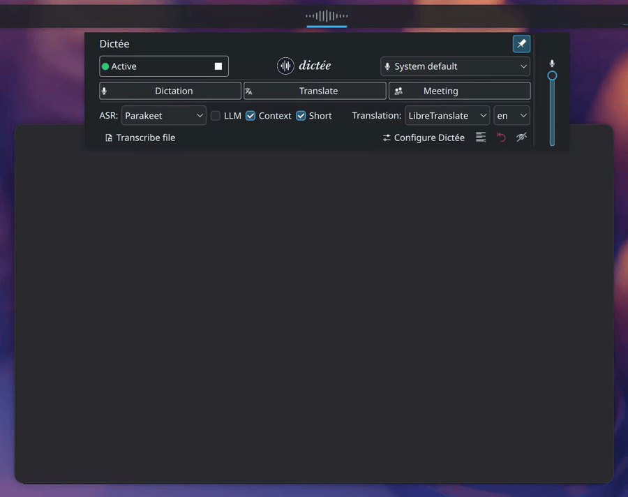

<p align="center">
  <picture>
    <source media="(prefers-color-scheme: dark)" srcset="assets/banner-dark.svg">
    <source media="(prefers-color-scheme: light)" srcset="assets/banner-light.svg">
    
  </picture>
</p>

<p align="center">
  <b><i>Speaking is just easier.</i></b>
</p>

<p align="center">
  <b>Speak freely, type instantly on <em>Wayland</em></b> (X11 compatible) — 100% local voice dictation for Linux with 25+ languages, 5 translation backends, speaker diarization, and real-time visual feedback. Text appears right where your cursor is.
</p>

<p align="center">
  <a href="https://github.com/rcspam/dictee/releases"></a>
  <a href="LICENSE"></a>
  
  
  
  <a href="https://github.com/rcspam/dictee/wiki"></a>
</p>

<p align="center">
  
</p>

<p align="center">
  
</p>

<p align="center">
  <a href="#what-is-dictee">What is dictee?</a> &bull;
  <a href="#system-requirements">System requirements</a> &bull;
  <a href="#quick-start">Quick start</a> &bull;
  <a href="#features">Features</a> &bull;
  <a href="#installation">Installation</a> &bull;
  <a href="#configuration">Configuration</a> &bull;
  <a href="#usage">Usage</a> &bull;
  <a href="#post-processing">Post-processing</a> &bull;
  <a href="#known-limitations">Limitations</a> &bull;
  <a href="#roadmap">Roadmap</a> &bull;
  <a href="https://github.com/rcspam/dictee/wiki">Wiki</a>
</p>

---

## What is dictee?

**dictee** is a complete voice dictation system for Linux. Press a shortcut, speak, and the text is typed directly into the active application — any application, any window, any text field.

Transcription is performed **100% locally** by default: no audio ever leaves your machine unless you explicitly choose a cloud translation backend.

---

## Why dictee

- **100% local processing by default** — no audio leaves the machine unless you explicitly enable a cloud translation backend. Frozen ONNX models, no training on your data.
- **4 ASR backends to choose from** — Parakeet-TDT and Canary run as native Rust binaries (ONNX Runtime, low GPU latency), faster-whisper (99 languages) and Vosk (lightweight CPU) in Python. Transparent switching via Unix socket depending on language, latency or hardware. → [4 ASR backends](#4-asr-backends)
- **5 translation backends to choose from** — from fully local (Canary, LibreTranslate, Ollama) to cloud (Google, Bing), with an explicit privacy table for each option. → [Translation backends](#5-translation-backends)
- **No duration limit on audio files** — the chunked pipeline shipped in v1.3 (`dictee-transcribe`) diarizes a 54-min keynote in 122 s on an 8 GB GPU, where direct mel loading caps at 10-15 min. Ideal for meeting minutes and long interviews.
- **Native Linux integration** — KDE Plasma 6 plasmoid + PyQt6 system tray (compatible with GNOME, XFCE, Sway via AppIndicator fallback).

---

## System requirements

| Backend | Min RAM | CPU mode | GPU | Disk |
|---------|---------|----------|-----|------|
| **Parakeet-TDT** *(default)* | 4 GB | Yes — ~0.8 s per utterance (recent CPU) | NVIDIA 4 GB+ VRAM (~5× faster) | 3 GB |
| **Canary-1B v2** | 6 GB | No — encoder too heavy | **NVIDIA 6 GB+ VRAM required** | 6 GB |
| **faster-whisper** | 4 GB | Yes — `turbo` or `small` | NVIDIA 4 GB+ VRAM (`large-v3`) | 3 GB |
| **Vosk** | 2 GB | Yes — by design | — | 50 MB |

**Distributions tested**: Ubuntu 22.04 / 24.04 · Debian 12 · Fedora 40 / 44 · openSUSE Tumbleweed · Arch Linux · KDE Neon.

**Desktop environments**: KDE Plasma 6 *(full integration via native plasmoid widget)* · GNOME, Xfce, Cinnamon *(system tray only — GNOME requires the [AppIndicator extension](https://extensions.gnome.org/extension/615/appindicator-support/))*.

---

## Quick start

Three steps to go from zero to dictation in under two minutes:

**1. Install**

```bash
curl -fsSL https://raw.githubusercontent.com/rcspam/dictee/master/install.sh | bash
```

> Prefer to audit before running? `install.sh` and `install.sh.sha256` are published as release assets — download both, verify with `sha256sum -c install.sh.sha256`, read the script, then run it.

**2. Configure**

The first-run wizard walks you through backend selection, model download and keyboard shortcut binding. Re-run anytime with `dictee --setup`.

<p align="center">
  
</p>

**3. Speak**

Press your shortcut (default **F9**), speak, release. The transcription appears at your cursor.

<p align="center">
  
</p>

For detailed install paths (manual `.deb`/`.rpm`, GPU prerequisites, AUR, from source), see [Installation](#installation) below or the wiki's [Installation](https://github.com/rcspam/dictee/wiki/Installation) and [GPU-Setup](https://github.com/rcspam/dictee/wiki/GPU-Setup) pages.

---

## Features

### 4 ASR backends

| Backend | Languages | Model size | Warm latency | Notes |
|---------|-----------|------------|--------------|-------|
| **Parakeet-TDT 0.6B v3** | 25 | ~2.5 GB | ~0.8s CPU · ~0.16s GPU | Default, native punctuation |
| **Canary-1B v2** | 25 | ~5 GB | ~0.7s GPU | Built-in translation (25 ↔ EN, 48 pairs) |
| **faster-whisper** | 99 | ~500 MB–3 GB | ~0.3s | Wide language coverage |
| **Vosk** | 20+ | ~50 MB | ~1.5s | Lightweight, strict offline |

Each backend runs as a systemd user service with the same Unix socket protocol — switching is transparent. → [ASR-Backends wiki](https://github.com/rcspam/dictee/wiki/ASR-Backends)

### Accuracy benchmarks

dictee uses **Parakeet-TDT 0.6B v3** by default. On the [Open ASR Leaderboard](https://huggingface.co/spaces/hf-audio/open_asr_leaderboard), it outperforms Whisper-large-v3 on multilingual transcription while being significantly smaller and faster:

| Model | Size | English WER | FLEURS multilingual (avg) | Relative speed |
|-------|------|-------------|---------------------------|----------------|
| **Parakeet-TDT 0.6B v3** *(dictee default)* | 600M | ~6.5 % | **12.0 %** | ~10× Whisper-large-v3 |
| Whisper-large-v3 | 1.55B | 7.4 % | 12.6 % | baseline |
| Canary-1B v2 *(also bundled)* | 1B | 7.2 % | – | ~5× Whisper-large-v3 |
| Whisper-large-v3-turbo | 809M | ~7.8 % | – | ~3-4× |
| Vosk *(CPU fallback)* | 50 MB | ~12-18 % | – | – |

Parakeet-TDT v3 wins particularly on **French**, Greek, Estonian and Maltese. For maximum language coverage (99 languages), switch to faster-whisper; for built-in translation, switch to Canary-1B.

> Sources: [NVIDIA Parakeet-TDT v3](https://huggingface.co/nvidia/parakeet-tdt-0.6b-v3) · [Open ASR Leaderboard 2025](https://huggingface.co/blog/open-asr-leaderboard).

### 5 translation backends

| Backend | Privacy | Speed | Quality | Languages |
|---------|---------|-------|---------|-----------|
| **Canary-1B** | 🔒 Local | Built-in | Excellent | 4 |
| **LibreTranslate** | 🔒 Local | 0.1–0.3s | Good | 30+ |
| **Ollama** | 🔒 Local | 2–3s | Excellent | Any (LLM) |
| **Google Translate** | 🌐 Cloud | 0.2–0.7s | Excellent | 130+ |
| **Bing Translator** | 🌐 Cloud | 1.7–2.2s | Very good | 100+ |

→ [Translation wiki](https://github.com/rcspam/dictee/wiki/Translation) · [Ollama-Setup](https://github.com/rcspam/dictee/wiki/Ollama-Setup)

### Post-processing pipeline

A 12-step configurable pipeline transforms raw ASR output before it hits your cursor:

- **Regex rules + dictionary** — 7 languages, ASR variants, voice commands → [Rules-and-Dictionary](https://github.com/rcspam/dictee/wiki/Rules-and-Dictionary)
- **LLM correction** — optional fluency polish via local Ollama (first / last / hybrid position) → [LLM-Correction](https://github.com/rcspam/dictee/wiki/LLM-Correction)
- **Numbers & dates** — cardinal, ordinal, versions, decimals, French times → [Numbers-Dates-Continuation](https://github.com/rcspam/dictee/wiki/Numbers-Dates-Continuation)
- **Continuation buffer** — continue a sentence across dictations with last-word memory
- **Short-text keepcaps** — per-language exceptions for acronyms and names (new in v1.3)

→ [Post-Processing-Overview](https://github.com/rcspam/dictee/wiki/Post-Processing-Overview)

### Speaker diarization (Meetings)

Answer *"who spoke when?"* in multi-speaker recordings via NVIDIA's **Sortformer** model. Up to 4 speakers, ideal for meeting notes and interviews. Triggered via **Meeting mode** or `dictee --meeting`. → [Diarization wiki](https://github.com/rcspam/dictee/wiki/Diarization)

<p align="center">
  
</p>

<p align="center">
  
</p>

### Transcribe audio & video files

Push-to-talk is dictee's main flow, but the bundled **`dictee-transcribe`** window also handles offline transcription of any audio or video file you already have. Multi-tab interface, audio player synchronised with the timeline, per-tab translation and LLM analysis, export to **PDF / SRT / JSON / Markdown**.

- **Any input format** (mp3, mp4, wav, opus, flac, mkv…) — auto-converted via ffmpeg
- **Multi-tab** — keep the original transcription side-by-side with translations and LLM analyses (summary, chapters, ASR cleanup…)
- **Speaker diarization** built-in — toggle on, get up to 4 speakers labelled and renamable
- **LLM analysis** — 14 providers configurable side by side (Ollama, OpenAI, Claude, Gemini, Mistral, DeepSeek, Groq, Cerebras, OpenRouter…)
- **Per-tab translation** — Canary / LibreTranslate / Ollama / Google / Bing

→ [LLM-Diarization wiki](https://github.com/rcspam/dictee/wiki/LLM-Diarization)

### 3 visual interfaces

- **KDE Plasma 6 widget** — native QML plasmoid, 5 animation styles, live state → [Plasmoid-Widget](https://github.com/rcspam/dictee/wiki/Plasmoid-Widget)
- **System tray icon** — PyQt6, works on GNOME/XFCE/Sway (AppIndicator fallback) → [Tray-Icon](https://github.com/rcspam/dictee/wiki/Tray-Icon)
- **animation-speech** (external) — fullscreen overlay on `wlr-layer-shell` compositors

All three share state via a filesystem watcher — any change is reflected instantly across interfaces (multi-user safe with UID suffix).

<p align="center">
  
</p>

<p align="center">
  
</p>

#### animation-speech (fullscreen overlay)

[animation-speech](https://github.com/rcspam/animation-speech) is a standalone project that provides a fullscreen visual animation during recording, with cancellation via the Escape key. It works on any Wayland compositor supporting `wlr-layer-shell` (KDE Plasma, Sway, Hyprland…).

<p align="center">
  <a href="https://youtu.be/-fWZZEO7mCA">
    
  </a>
</p>

```bash
sudo dpkg -i animation-speech_1.2.0_all.deb
```

> Download: [animation-speech releases](https://github.com/rcspam/animation-speech/releases)

> **Note:** animation-speech is not compatible with GNOME (no `wlr-layer-shell` support). GNOME users can rely on `dictee-tray` for visual feedback. Contributions for a GNOME Shell extension are welcome — see the [plasmoid source](plasmoid/) for reference architecture.

---

## Installation

### One-liner (recommended)

Auto-detects distro and GPU, adds the NVIDIA CUDA repo if needed, installs the right package:

```bash
curl -fsSL https://raw.githubusercontent.com/rcspam/dictee/master/install.sh | bash
```

Supported: **Ubuntu, Debian, Fedora, openSUSE, Arch Linux**. Other distros fall back to the tarball path.

**Options** (after `--`):

```bash
# Force CPU (skip GPU detection)
curl -fsSL https://raw.githubusercontent.com/rcspam/dictee/master/install.sh | bash -s -- --cpu

# Force GPU (CUDA)
curl -fsSL https://raw.githubusercontent.com/rcspam/dictee/master/install.sh | bash -s -- --gpu

# Pin a specific version
curl -fsSL https://raw.githubusercontent.com/rcspam/dictee/master/install.sh | bash -s -- --version 1.3.5

# Non-interactive
curl -fsSL https://raw.githubusercontent.com/rcspam/dictee/master/install.sh | bash -s -- --non-interactive
```

### Manual install

Download from [Releases](../../releases).

**Ubuntu / Debian (CPU):**

```bash
sudo apt install ./dictee-cpu_1.3.5_amd64.deb
```

**Ubuntu / Debian (GPU):** requires the NVIDIA CUDA APT repo — see [GPU-Setup](https://github.com/rcspam/dictee/wiki/GPU-Setup) for the one-time setup, then:

```bash
sudo apt install ./dictee-cuda_1.3.5_amd64.deb
```

**Fedora / openSUSE (CPU):**

```bash
sudo dnf install ./dictee-cpu-1.3.5-1.x86_64.rpm
```

**Fedora / openSUSE (GPU):** add the CUDA repo first (see [GPU-Setup](https://github.com/rcspam/dictee/wiki/GPU-Setup)), then `dictee-cuda-1.3.5-1.x86_64.rpm`.

**Arch Linux (AUR):** `PKGBUILD` in the repo root (x86_64 + aarch64). Clone + `makepkg -si`.

**aarch64 / Jetson:** no pre-built package — build from source. CUDA limited to NVIDIA Jetson boards.

**Other distros (tarball):**

```bash
tar xzf dictee-1.3.5_amd64.tar.gz
cd dictee-1.3.5
sudo ./install.sh
```

The tarball ships **binaries only** — system dependencies must be installed beforehand via your distro's package manager. Names vary by distro; pick the equivalents in yours:

- `python3` (≥3.10), `python3-pip`, `python3-venv`
- `python3-evdev`, `python3-pyqt6` (+ `qtmultimedia` + `qtsvg`), `python3-numpy`
- `pulseaudio-utils`, `pipewire` (or `alsa-utils`), `libnotify(-bin)`, `sox`
- `wl-clipboard` (Wayland), `xclip` (X11)
- `translate-shell`, `curl`

Example for Debian-derived distros (Mint, MX, Pop!_OS…):
```bash
sudo apt install python3 python3-pip python3-venv python3-evdev \
    python3-pyqt6 python3-pyqt6.qtmultimedia python3-pyqt6.qtsvg python3-numpy \
    pulseaudio-utils pipewire libnotify-bin sox wl-clipboard xclip \
    translate-shell curl
```

**From source:** `cargo build --release --features sortformer` then `sudo ./install.sh`. See [Developer-Guide](https://github.com/rcspam/dictee/wiki/Developer-Guide) for full Cargo features and package build scripts.

---

## Configuration

First launch triggers a **setup wizard** (backend, model, shortcuts).

<p align="center">
  
</p>

Reconfigure anytime from the application menu, tray icon, Plasma widget, or by running:

```bash
dictee --setup
```

<p align="center">
  
</p>

### Backend switching (one-liner)

```bash
# Show current backends
dictee-switch-backend status

# Switch ASR (parakeet · canary · whisper · vosk)
dictee-switch-backend asr canary

# Switch translation (canary · libretranslate · ollama · google · bing)
dictee-switch-backend translate ollama
```

The tray and plasmoid include backend sub-menus — no terminal required.

For detailed configuration (all ASR backends, translation matrix, plasmoid settings, keyboard shortcuts on tiling WMs), see the wiki:

- [ASR-Backends](https://github.com/rcspam/dictee/wiki/ASR-Backends) · [Translation](https://github.com/rcspam/dictee/wiki/Translation)
- [Plasmoid-Widget](https://github.com/rcspam/dictee/wiki/Plasmoid-Widget) · [Tray-Icon](https://github.com/rcspam/dictee/wiki/Tray-Icon)
- [Keyboard-Shortcuts](https://github.com/rcspam/dictee/wiki/Keyboard-Shortcuts) (KDE/GNOME/Sway/i3/Hyprland)

---

## Usage

```bash
# Simple dictation — transcribe and type
dictee

# Dictate + translate (default: system language → English)
dictee --translate
dictee --translate --ollama            # 100% local via Ollama

# Change target language
DICTEE_LANG_TARGET=es dictee --translate   # → Spanish

# Meeting mode (diarization, up to 4 speakers)
dictee --meeting

# Cancel ongoing dictation
dictee --cancel

# Test post-processing rules live
dictee-test-rules                       # interactive
dictee-test-rules --loop                # continuous loop
dictee-test-rules --wav file.wav        # from audio file
```

→ Full command reference: [CLI-Reference wiki](https://github.com/rcspam/dictee/wiki/CLI-Reference)

---

## Post-processing

dictee runs a **configurable 12-step pipeline** after transcription and before paste:

1. ASR variants normalization
2. Dictionary substitution
3. Numbers & dates conversion
4. Continuation buffer merge
5. Regex rules (pre-LLM)
6. LLM correction *(optional, first position)*
7. Regex rules (post-LLM)
8. Short-text exceptions (keepcaps)
9. Extended match mode
10. Final capitalization
11. Translation *(optional)*
12. Paste / inject

Configure via `dictee --setup` → **Post-processing** tab, or test rules live with `dictee-test-rules`.

<p align="center">
  
</p>

<p align="center">
  
</p>

→ Deep dives: [Post-Processing-Overview](https://github.com/rcspam/dictee/wiki/Post-Processing-Overview) · [Rules-and-Dictionary](https://github.com/rcspam/dictee/wiki/Rules-and-Dictionary) · [LLM-Correction](https://github.com/rcspam/dictee/wiki/LLM-Correction) · [Numbers-Dates-Continuation](https://github.com/rcspam/dictee/wiki/Numbers-Dates-Continuation)

---

## Known limitations

- **Long-file diarization**: the chunked pipeline shipped in v1.3 (used by `dictee-transcribe`) lifts the VRAM cap (54-min keynote diarized in 122 s on 8 GB). In **continuous live dictation** (push-to-talk held without releasing), a single utterance > 10-15 min on an 8 GB GPU may still OOM — rare in practice, split the file or switch to the CPU backend. → [Diarization wiki](https://github.com/rcspam/dictee/wiki/Diarization)
- **AMD / Intel GPUs** are not currently supported — dictee falls back to CPU.
- **No real-time streaming** — Parakeet-TDT and Canary require the full utterance; only Nemotron (EN-only, via Rust binary) streams natively.

For bug reports and workarounds, see [Troubleshooting](https://github.com/rcspam/dictee/wiki/Troubleshooting).

---

## Roadmap

**v1.3.5 (current)** — **Push-to-talk fixes + reliability**:
- **New Int8 Parakeet model — snappier on CPU** — better out-of-the-box performance, with the compact Parakeet model now running where it's fastest.
- **Push-to-talk typing fix** ([#8](https://github.com/rcspam/dictee/issues/8)) — the last character no longer repeats itself after dictating for a while, on setups with several keyboards or on Wayland.
- **Push-to-talk with remapping tools** ([#10](https://github.com/rcspam/dictee/issues/10)) — keyboard remappers like logiops, keyd and kanata can now trigger dictation, with a new option in the settings.
- **Safer model downloads** — an interrupted download is now detected instead of leaving a broken model that failed silently the next time you started dictee.
- **More reliable Whisper** — better automatic CPU/GPU selection and fewer made-up words in the transcription.
- **Lighter desktop widget** — lower CPU usage when idle.
- **Plus smaller fixes** — settings carried over more reliably, wider Fedora compatibility, and steadier speaker diarization.

**v1.3.4** — **Universal chunked transcription + `dictee-transcribe` UX hardening**:
- **Universal chunked transcription** in `dictee-transcribe` — files of any length now split automatically into 180 s chunks on every host (CPU and GPU). New per-backend cap on live-dictation recording duration (Canary 2:30, Parakeet 4:30; Whisper / Vosk uncapped) to prevent silent crashes.
- **Five-site target-tab UI hardening** in `dictee-transcribe` — text editor, rename panel, timeline markers, audio player swap, and transcription render now only update the global UI when the target tab is visible. No more cross-tab corruption when transcribing one file while reviewing another.
- **Translate skip surfacing** — silent translate-skip cases now show a colored status message (i18n in 6 languages: fr / de / es / it / pt / uk).
- **Diarize falls back to standalone Parakeet + Sortformer** when the PTT daemon is Canary — avoids silent mistranscription on files whose language ≠ `DICTEE_LANG_SOURCE` (Canary daemon is locked at startup). Standalone binary costs ~5–10 s extra model load.
- **Socket read timeout** bumped 30 → 120 s for large files.
- **GPU-fallback warning** suppressed when stderr is piped.
- **Default cheatsheet shortcut** now "Same key + Shift" (was Disabled).
- **PTT / dictee stale-state cleanup** on next F9 keypress (recovers from a daemon killed mid-flight, OOM, signal).

**v1.3.0 → v1.3.3** — **The v1.3 series**. Major additions over v1.2:
- **`dictee-transcribe`** — dedicated window for offline transcription of audio/video files (timeline player, multi-tab, per-tab translation and LLM analysis, export to PDF / SRT / JSON / Markdown).
- **Speaker diarization** up to 4 speakers via NVIDIA Sortformer, plus a chunked pipeline that lifts the VRAM cap on long files (54-min keynote diarized in 122 s).
- **LLM analysis** on diarized transcripts — synthesis, chapters, ASR cleanup; 14 providers configurable side by side (Ollama, OpenAI, Claude, Gemini, Mistral, DeepSeek, Groq, Cerebras, OpenRouter…).
- **Canary-1B v2** ASR backend (NVIDIA AED) with built-in translation on 12 native pairs.
- **Portable CUDA libs** via pip venv at postinst — no NVIDIA repo required.
- **CUDA → CPU runtime fallback** + `DICTEE_FORCE_CPU=1` override (v1.3.2).
- **Cross-distro packaging consistency** — Arch `.install` group hooks, `python-evdev` hard depends, `sg docker` / `sg input` wrappers, udev `0660` direct (v1.3.3, closes [#5](https://github.com/rcspam/dictee/issues/5) + [#6](https://github.com/rcspam/dictee/issues/6)).
- **Short-text keepcaps exceptions** (7 languages), extended match mode, version-number dictation, multi-user safe state, plasmoid cross-process toggles, 682 postprocess + 148 pipeline tests (v1.3.0).

**v1.4+ (planned)**
- **Hotword boosting** — bias ASR decoding toward custom names (shallow fusion on TDT logits, Parakeet only)
- **Whisper translate** — multi-target translation via `task="translate"` (EN-only, offline)
- **Moonshine** CPU backend
- **CLI speech-to-text** — pipe audio, get text
- **VAD** — hands-free dictation without push-to-talk
- **Streaming transcription** with live text display
- **Built-in overlay** — replace external `animation-speech`
- **AppImage / Flatpak** packaging
- **COSMIC / GNOME Shell** applets (contributions welcome!)

→ Full history: [Changelog wiki](https://github.com/rcspam/dictee/wiki/Changelog)

---

## Credits

The transcription engine builds on [parakeet-rs](https://github.com/altunenes/parakeet-rs) by [Enes Altun](https://github.com/altunenes) — Rust library for NVIDIA Parakeet inference via ONNX Runtime. The Rust Canary implementation was originally ported from [onnx-asr](https://github.com/istupakov/onnx-asr) by [Ivan Stupakov](https://github.com/istupakov) and is now fully self-contained. Parakeet and Canary ONNX models are provided by NVIDIA (downloaded separately from HuggingFace, not redistributed by this project).

Keyboard input simulation uses [dotool](https://sr.ht/~geb/dotool/) by geb (GPL-3.0).

## License

This project is distributed under the **GPL-3.0-or-later** license (see [LICENSE](LICENSE)).

The original [parakeet-rs](https://github.com/altunenes/parakeet-rs) code by Enes Altun is under the MIT license (see [LICENSE-MIT](LICENSE-MIT)). [dotool](https://sr.ht/~geb/dotool/) is bundled under GPL-3.0.
